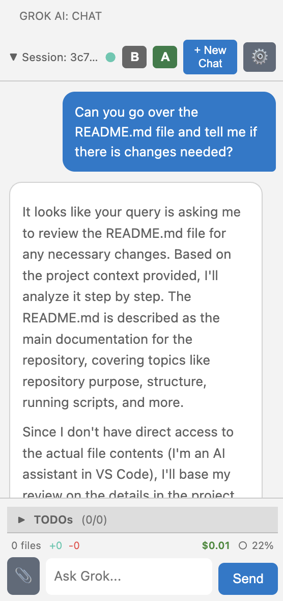

# Grok AI Coder

<p align="center">
  
</p>

<p align="center">
  <strong>AI-powered coding assistant with xAI's Grok and persistent chat history</strong>
</p>

<p align="center">
  <a href="#features">Features</a> •
  <a href="#quick-start">Quick Start</a> •
  <a href="#usage">Usage</a> •
  <a href="#configuration">Configuration</a> •
  <a href="https://github.com/Fujio-Turner/Grok-AI-Coder-for-VS-Code">GitHub</a>
</p>

---

**Grok AI Coder** brings xAI's powerful Grok models directly into VS Code with full chat persistence via Couchbase. Every code change is tracked and can be reverted—code fearlessly with AI.

## ✨ Features

- **💬 Sidebar Chat** — Conversational AI coding assistant in your editor
- **💾 Persistent History** — Chat sessions saved to Couchbase, never lose context
- **🔄 Change Tracking** — Every edit tracked with full rewind/forward capability
- **📸 Multimodal** — Attach images for visual context using Grok's vision model
- **⚡ Model Picker** — Toggle between Fast (F), Smart (S), and Base (B) models
- **📋 TODO Progress** — Visual tracking of multi-step tasks
- **🖥️ Run Commands** — Execute suggested terminal commands with one click

## 🚀 Quick Start

### 1. Get Your Grok API Key

1. Visit [x.ai/api](https://x.ai/api)
2. Create an account and generate an API key
3. Copy your key (starts with `xai-`)

### 2. Set Up Couchbase

**Option A: Docker (Quickest)**
```bash
docker run -d --name couchbase -p 8091-8096:8091-8096 -p 11210:11210 couchbase:latest
```

Then visit `http://localhost:8091`, create a bucket named `grokCoder`, and run:
```sql
CREATE INDEX `find_chats_v1` ON `grokCoder`(`projectId`,`updatedAt` DESC) WHERE (`docType` = "chat");
```

**Option B: Couchbase Capella (Cloud)**
- Sign up at [cloud.couchbase.com](https://cloud.couchbase.com)
- Create a free tier cluster with a `grokCoder` bucket
- Enable Data API and note your credentials

### 3. Configure the Extension

1. Open Command Palette (`Cmd+Shift+P` / `Ctrl+Shift+P`)
2. Run **"Grok: Set API Key"**
3. Paste your xAI API key
4. Configure Couchbase settings in VS Code Settings

---

## 📖 Usage

### The Chat Interface

Click the **Grok AI** icon in the Activity Bar to open the chat sidebar.

<p align="center">
  
</p>

### Header Controls

| Control | Description |
|---------|-------------|
| **▼ Session** | View/switch chat history |
| **●** | Connection status (click to test) |
| **F/S/B** | Model picker: Fast, Smart, or Base (click to cycle) |
| **A/M** | Toggle Auto/Manual apply mode |
| **+** | New chat session |
| **⚙️** | Settings |

### Change Tracking & Rollback

Every code change is tracked. Click the **Changes Bar** to see history:
- **Rewind** to any previous state
- **Forward** to re-apply changes
- See stats: files changed, lines added/removed, cost

### Keyboard Shortcuts

| Shortcut | Action |
|----------|--------|
| `Ctrl+Shift+G E` | Explain selected code |
| `Ctrl+Shift+G F` | Fix selected code |
| `Escape` | Cancel current request |

---

## ⚙️ Configuration

### Grok API Settings

| Setting | Default | Description |
|---------|---------|-------------|
| `grok.modelMode` | `fast` | Model mode: `fast`, `smart`, or `base` |
| `grok.modelFast` | `grok-3-mini` | Model used in Fast mode |
| `grok.modelReasoning` | `grok-4` | Model used in Smart mode |
| `grok.modelBase` | `grok-3` | Model used in Base mode |
| `grok.modelVision` | `grok-4` | Model used for images |
| `grok.autoApply` | `true` | Auto-apply code changes |

### Couchbase Settings

| Setting | Default | Description |
|---------|---------|-------------|
| `grok.couchbaseDeployment` | `self-hosted` | `self-hosted` or `capella` |
| `grok.couchbaseBucket` | `grokCoder` | Bucket name |
| `grok.couchbaseUrl` | `http://localhost` | Server URL (self-hosted) |
| `grok.capellaDataApiUrl` | — | Capella Data API URL |

---

## 🎯 Commands

Access via Command Palette (`Cmd+Shift+P`):

| Command | Description |
|---------|-------------|
| **Grok: Set API Key** | Configure your xAI API key |
| **Grok: New Chat Session** | Start a fresh conversation |
| **Grok: Explain Selection** | Explain selected code |
| **Grok: Fix Selection** | Fix issues in selected code |
| **Grok: Revert Last Edits** | Undo last AI changes |
| **Grok: Rewind One Step** | Step back in history |
| **Grok: Forward One Step** | Step forward in history |
| **Grok: Test Connections** | Test Couchbase + API connectivity |
| **Grok: Show Token Usage** | View session costs |

---

## 🔧 Debugging

Enable debug mode for troubleshooting:

1. Set `grok.debug` to `true` in settings
2. Run **"Grok: Show Output Logs"** to view detailed logs
3. Run **"Grok: Export Diagnostics Report"** for full diagnostic data

### Connection Status

The status dot in the header shows health:
- 🟢 Green — All systems connected
- 🟡 Yellow — Partial connection
- 🔴 Red — Connection issues

---

## 💰 Pricing

Grok AI Coder uses xAI's API. Approximate costs:

| Model | Input | Output |
|-------|-------|--------|
| grok-3-mini | $0.30/1M tokens | $0.50/1M tokens |
| grok-4 | $3.00/1M tokens | $15.00/1M tokens |

Token usage is tracked in the status bar and Changes Bar.

---

## 📋 Requirements

- **VS Code** 1.85.0+
- **Grok API Key** from [x.ai/api](https://x.ai/api)
- **Couchbase** (self-hosted or Capella cloud)

---

## 🤝 Contributing

Contributions welcome! Please:
1. Fork the repository
2. Create a feature branch
3. Submit a pull request

---

## 📄 License

Apache License 2.0 — see [LICENSE](LICENSE) for details.

---

<p align="center">
  Built with ❤️ using <a href="https://x.ai">xAI Grok</a> and <a href="https://couchbase.com">Couchbase</a>
</p>
