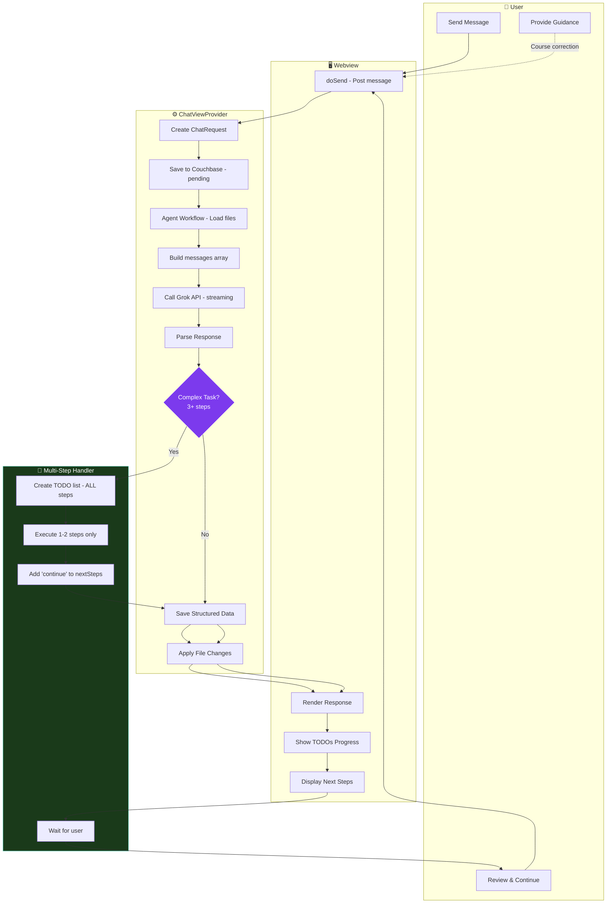

# Chat Flow Design

## Architecture Diagram



[View/Edit on Mermaid Live](https://mermaid.live)

---

## Complete Flow

### 1. **Webview (User Click)**
- `doSend()` gets text from textarea, clears input
- Posts `{type:'sendMessage', text, images}` to extension

### 2. **ChatViewProvider.sendMessage()**
- Creates `ChatRequest` with timestamp
- **Saves to Couchbase** with `status: 'pending'`
- Sends `newMessagePair` → webview renders user bubble + spinner

### 3. **Agent Workflow** (if no images)
- Analyzes request for file/URL references
- Loads matching files into context
- Shows progress: "🔍 Analyzing..." → "📂 Loaded X files"

### 4. **Main API Call**
- Builds messages array (system prompt + history + user message)
- Calls `sendChatCompletion()` with streaming
- Each chunk → `updateResponseChunk` → webview shows partial text

### 5. **SAVE EARLY** (new!)
- Immediately saves raw response text to Couchbase
- Prevents data loss if parsing crashes

### 6. **Parse Response**
- Tries `parseResponse()` (regex-based JSON repair)
- If fails + cleanup enabled → `cleanJsonWithModel()` (AI fixes JSON)
- Extracts: `summary`, `sections`, `todos`, `fileChanges`, `commands`, `nextSteps`

### 7. **Save Structured Response**
- Updates Couchbase with full `structured` data
- Records usage (tokens, cost)

### 8. **File Changes** (if any)
- Resolves paths, validates changes
- Calculates diff stats (+added/-removed)
- If `autoApply` → writes files immediately

### 9. **Render Final Output**
- Sends `requestComplete` with `structured` + `diffPreview`
- Webview calls `fmtFinalStructured()` to build HTML:
  - Summary paragraph
  - Sections with headings
  - Code blocks with syntax highlighting
  - File changes with Apply buttons
  - Commands with Run buttons
  - Next Steps buttons
  - "What was done" summary
  - Done bar with action buttons + token count
- Caches HTML in webview state
- Scrolls to bottom

---

## Multi-Step Task Handling

### Problem: Response Truncation

Complex tasks that require 3+ file changes or span multiple concerns (frontend, backend, config, docs) can cause the AI to generate massive responses that get truncated mid-output. This results in:
- Incomplete JSON that fails to parse
- Partial file changes that corrupt files
- Lost work that must be regenerated

### Solution: Incremental Execution

The system prompt now instructs the AI to execute complex tasks **one step at a time**:

```
┌─────────────────┐     ┌─────────────────┐     ┌─────────────────┐
│  User Request   │────▶│  First Response │────▶│  User: continue │
│  (complex task) │     │  (1-2 steps)    │     │                 │
└─────────────────┘     └─────────────────┘     └────────┬────────┘
                                                         │
         ┌───────────────────────────────────────────────┘
         ▼
┌─────────────────┐     ┌─────────────────┐     ┌─────────────────┐
│  Next Response  │────▶│  User: continue │────▶│  Final Response │
│  (1-2 steps)    │     │                 │     │  (remaining)    │
└─────────────────┘     └─────────────────┘     └─────────────────┘
```

### How It Works

1. **Detection**: AI recognizes tasks with 3+ steps, 3+ files, or multiple concerns
2. **Planning**: Creates TODO list with ALL steps upfront
3. **Execution**: Completes only first 1-2 steps per response
4. **Continuation**: Adds `nextSteps: ["Say 'continue' to proceed"]`
5. **Iteration**: On "continue", marks steps complete, executes next batch

### Why This Matters: Course Correction

This incremental approach is valuable beyond just preventing truncation:

- **Mistakes are recoverable**: If the AI makes a wrong decision in step 2, the user can correct it before step 3 builds on that mistake
- **User guidance**: The user can redirect the approach ("actually, use library X instead") without starting over
- **Objective alignment**: The ultimate goal of the task is best understood by the user - they can steer the AI toward their vision
- **Learning opportunity**: AI can ask clarifying questions between steps if something is ambiguous
- **Checkpoint saves**: Each step is saved to Couchbase, so work is never lost even if the session is interrupted

### Example Flow

**User**: "Set up deployment for Mac, Windows, and Docker"

**Response 1**:
```json
{
  "summary": "Created config.sample.json for deployment configuration.",
  "todos": [
    {"text": "Create config.sample.json", "completed": true},
    {"text": "Update Mac deployment docs", "completed": false},
    {"text": "Update Windows deployment docs", "completed": false},
    {"text": "Update Docker configuration", "completed": false}
  ],
  "fileChanges": [{"path": "app/config.sample.json", ...}],
  "nextSteps": ["Say 'continue' to proceed with Mac deployment"]
}
```

**User**: "continue"

**Response 2**:
```json
{
  "summary": "Updated Mac deployment configuration.",
  "todos": [
    {"text": "Create config.sample.json", "completed": true},
    {"text": "Update Mac deployment docs", "completed": true},
    {"text": "Update Windows deployment docs", "completed": false},
    {"text": "Update Docker configuration", "completed": false}
  ],
  "fileChanges": [{"path": "docs/mac-deploy.md", ...}],
  "nextSteps": ["Say 'continue' to proceed with Windows deployment"]
}
```

### Bug Reporting for Truncation

When truncation is detected (incomplete JSON with recoverable file changes):
1. Warning shown to user: "Response was truncated!"
2. Automatic bug report created with `type: 'Other'`, `by: 'script'`
3. Bug stored in session's `bugs[]` array in Couchbase

---

## Future: Sub-Task Architecture & Concurrent Operations

### Vision

Break complex tasks into independent sub-operations that can be executed in parallel by separate AI requests, then merged back together. This would dramatically improve:
- **Speed**: Parallel execution instead of sequential
- **Reliability**: Smaller responses = less truncation risk
- **Cost efficiency**: Use cheaper/faster models for simple sub-tasks

### Proposed Architecture

```
┌──────────────────────────────────────────────────────────────────┐
│                        ORCHESTRATOR                              │
│  - Receives user request                                         │
│  - Analyzes task complexity                                      │
│  - Creates sub-task plan                                         │
│  - Dispatches to workers                                         │
│  - Merges results                                                │
└──────────────────────────────────────────────────────────────────┘
         │                    │                    │
         ▼                    ▼                    ▼
┌─────────────────┐  ┌─────────────────┐  ┌─────────────────┐
│   SUB-TASK A    │  │   SUB-TASK B    │  │   SUB-TASK C    │
│  (grok-3-mini)  │  │  (grok-3-mini)  │  │  (grok-3-mini)  │
│                 │  │                 │  │                 │
│  "Create the    │  │  "Update the    │  │  "Write the     │
│   config file"  │  │   Mac docs"     │  │   Dockerfile"   │
└─────────────────┘  └─────────────────┘  └─────────────────┘
         │                    │                    │
         └────────────────────┼────────────────────┘
                              ▼
                    ┌─────────────────┐
                    │     MERGER      │
                    │  - Collects all │
                    │    fileChanges  │
                    │  - Validates    │
                    │  - Presents UI  │
                    └─────────────────┘
```

### Sub-Task Document Schema (Couchbase)

```json
{
  "docType": "subtask",
  "parentSessionId": "session-uuid",
  "subtaskId": "subtask-uuid",
  "status": "pending | running | completed | failed",
  "priority": 1,
  "dependencies": ["subtask-uuid-1"],
  "input": {
    "instruction": "Create config.sample.json with placeholder credentials",
    "contextFiles": ["app/config.json"],
    "constraints": ["Use JSON format", "Include comments"]
  },
  "output": {
    "fileChanges": [...],
    "summary": "...",
    "tokensUsed": 500
  },
  "model": "grok-3-mini",
  "createdAt": "...",
  "completedAt": "..."
}
```

### Orchestration Strategies

#### 1. **Dependency Graph Execution**
- Build DAG of sub-tasks
- Execute independent tasks in parallel
- Wait for dependencies before dependent tasks

```
Example: "Add authentication to the app"

Sub-tasks with dependencies:
1. Create auth config         ──┐
2. Create JWT utilities       ──┼──▶ 4. Create auth middleware ──▶ 5. Update routes
3. Create user model          ──┘
```

#### 2. **Map-Reduce Pattern**
- Split large operations across files
- Each worker handles one file
- Merge all changes at end

```
Example: "Add error handling to all API endpoints"

Map: [route1.ts, route2.ts, route3.ts, route4.ts]
     Each gets own AI call with specific file context
Reduce: Collect all fileChanges, present unified diff
```

#### 3. **Specialist Models**
- Route sub-tasks to appropriate model size
- Simple tasks → grok-3-mini (fast, cheap)
- Complex reasoning → grok-4 (slow, expensive)
- Code review → grok-4 with specific prompts

### Implementation Phases

#### Phase 1: Manual Sub-Tasks (Current)
- AI suggests breaking into steps
- User manually says "continue"
- State tracked in TODO list

#### Phase 2: Semi-Automated (Near Future)
- "Auto-continue" toggle in UI
- System automatically sends "continue" after each step
- User can pause/resume

#### Phase 3: Parallel Execution (Future)
- Orchestrator analyzes request complexity
- Creates sub-task documents in Couchbase
- Spawns parallel API calls
- Merges results with conflict detection
- Presents unified output

### Concurrency Considerations

| Concern | Solution |
|---------|----------|
| **File conflicts** | Lock files during sub-task execution; detect overlapping edits |
| **Context limits** | Each sub-task gets minimal context (only files it needs) |
| **Error handling** | Failed sub-task → retry or escalate to user |
| **Cost tracking** | Aggregate token usage across all sub-tasks |
| **Rate limits** | Queue system with configurable parallelism |

### API Design Sketch

```typescript
interface SubTaskPlan {
  tasks: SubTask[];
  executionOrder: 'sequential' | 'parallel' | 'dependency-graph';
  estimatedCost: number;
  estimatedTimeMs: number;
}

interface SubTask {
  id: string;
  instruction: string;
  contextFiles: string[];
  model: 'grok-3-mini' | 'grok-4';
  dependsOn: string[];
  priority: number;
}

// Orchestrator methods
async function planSubTasks(request: string): Promise<SubTaskPlan>;
async function executeSubTasks(plan: SubTaskPlan): Promise<MergedResult>;
async function mergeResults(results: SubTaskResult[]): Promise<FileChange[]>;
```

### Benefits of This Architecture

1. **Eliminates truncation**: Each sub-task produces small, focused output
2. **Faster completion**: Parallel execution of independent tasks
3. **Lower costs**: Use cheaper models for simple sub-tasks
4. **Better reliability**: Retry individual failures without losing progress
5. **Transparent progress**: Show real-time status of each sub-task
6. **Resumable**: Sub-task state persisted in Couchbase

### Design Decisions

#### Q: How to handle sub-tasks that need to reference each other's output?

**Solution**: Use Couchbase to store shared/intermediate data. Each sub-task can read from and write to a shared context document:

```json
{
  "docType": "subtask-context",
  "parentSessionId": "session-uuid",
  "sharedData": {
    "authConfig": { "jwtSecret": "..." },
    "createdFiles": ["src/auth/config.ts", "src/auth/jwt.ts"]
  },
  "stepOutputs": {
    "subtask-1": { "exportedTypes": ["User", "AuthToken"] },
    "subtask-2": { "middlewareName": "authMiddleware" }
  }
}
```

Dependent sub-tasks wait for their dependencies to complete and read from `stepOutputs`.

---

#### Q: Should users be able to edit/reorder the sub-task plan before execution?

**Solution**: Present execution strategy options to the user upfront with recommendations:

```
┌─────────────────────────────────────────────────────────────────┐
│  📋 Execution Plan: "Add authentication to the app"            │
├─────────────────────────────────────────────────────────────────┤
│  Found 5 sub-tasks. Choose execution strategy:                 │
│                                                                 │
│  ○ A) Parallel (Recommended)                                   │
│      Speed: ⚡⚡⚡  Cost: $0.04  Risk: Medium                   │
│      4 tasks run simultaneously, 1 waits for dependencies      │
│                                                                 │
│  ○ B) Sequential                                                │
│      Speed: ⚡     Cost: $0.03  Risk: Low                       │
│      Safest option, but takes longer                           │
│                                                                 │
│  ○ C) Fast & Loose                                              │
│      Speed: ⚡⚡⚡⚡ Cost: $0.05  Risk: High                     │
│      All parallel, may need conflict resolution                │
│                                                                 │
│  [Edit Plan]  [Start A]  [Start B]  [Start C]                  │
└─────────────────────────────────────────────────────────────────┘
```

User can also click "Edit Plan" to reorder, remove, or modify sub-tasks before execution.

---

#### Q: How to present parallel progress in the UI?

**Solution**: Stacked progress bars, one per sub-task:

```
┌─────────────────────────────────────────────────────────────────┐
│  🔄 Running 3 sub-tasks in parallel...                         │
├─────────────────────────────────────────────────────────────────┤
│  1. Create auth config      ████████████████████░░░░  80%      │
│  2. Create JWT utilities    ██████████████████████░░  90%  ✓   │
│  3. Create user model       ████████░░░░░░░░░░░░░░░░  35%      │
├─────────────────────────────────────────────────────────────────┤
│  ⏳ Waiting: 4. Create auth middleware (depends on 1, 2, 3)    │
│  ⏳ Waiting: 5. Update routes (depends on 4)                   │
└─────────────────────────────────────────────────────────────────┘
```

Each bar shows:
- Sub-task name
- Visual progress
- Percentage
- Checkmark when complete
- "Waiting" status for dependent tasks

---

#### Q: What's the optimal sub-task granularity?

**Solution**: Let the AI suggest options and ask user to choose:

```
┌─────────────────────────────────────────────────────────────────┐
│  📊 Task Breakdown Options                                      │
├─────────────────────────────────────────────────────────────────┤
│  Your request can be broken down in different ways:            │
│                                                                 │
│  A) Fine-grained (Recommended)                                  │
│     12 sub-tasks, ~200 tokens each                             │
│     ✓ Lowest truncation risk                                   │
│     ✓ Best parallelism                                         │
│     ✗ More API overhead                                        │
│                                                                 │
│  B) Medium                                                      │
│     5 sub-tasks, ~800 tokens each                              │
│     ✓ Good balance                                             │
│     ~ Moderate risk                                            │
│                                                                 │
│  C) Coarse                                                      │
│     2 sub-tasks, ~2000 tokens each                             │
│     ✓ Fewer API calls                                          │
│     ✗ Higher truncation risk                                   │
│                                                                 │
│  [Use A]  [Use B]  [Use C]  [Let AI decide]                    │
└─────────────────────────────────────────────────────────────────┘
```

Default to "Let AI decide" which uses heuristics based on:
- Task complexity
- Number of files involved
- Historical truncation rates for similar tasks