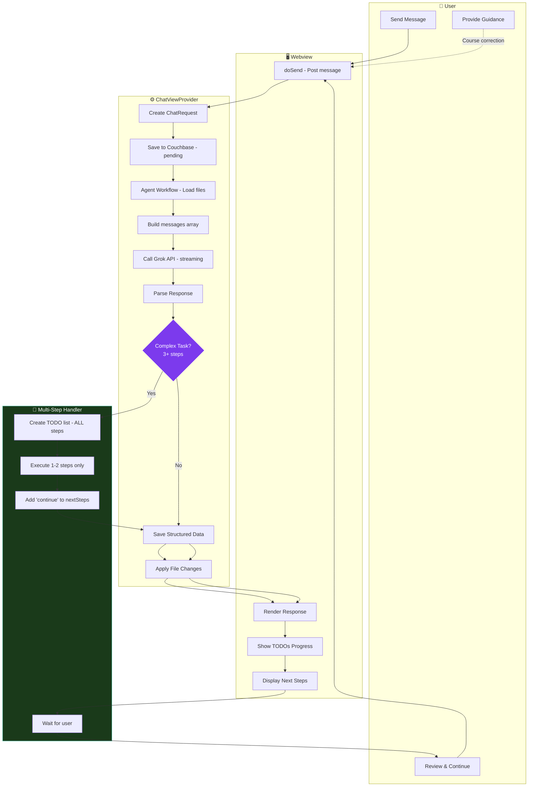
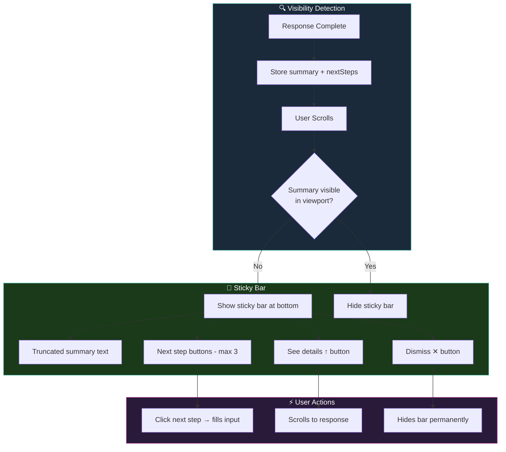
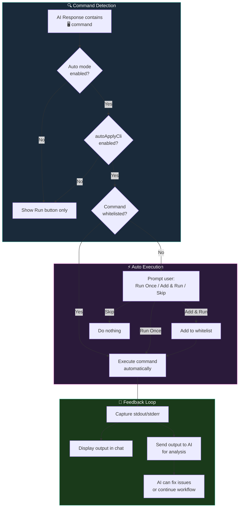
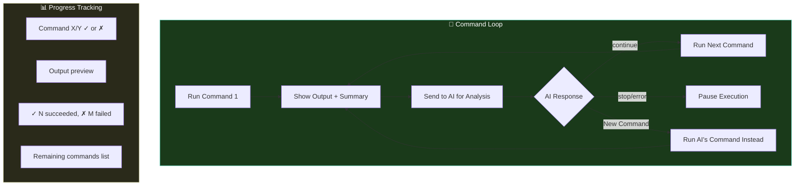
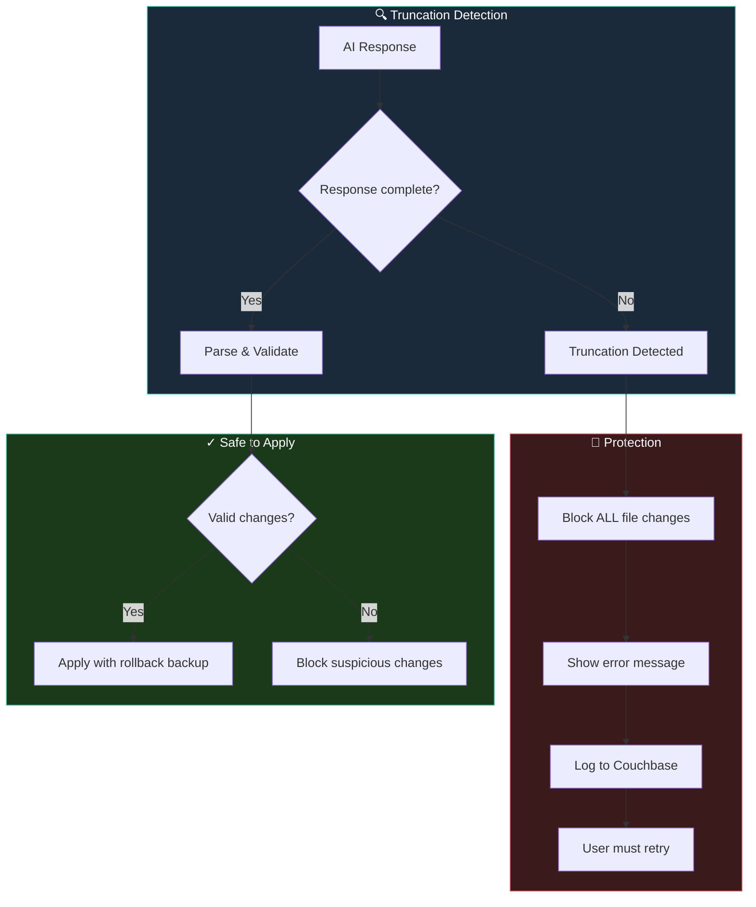
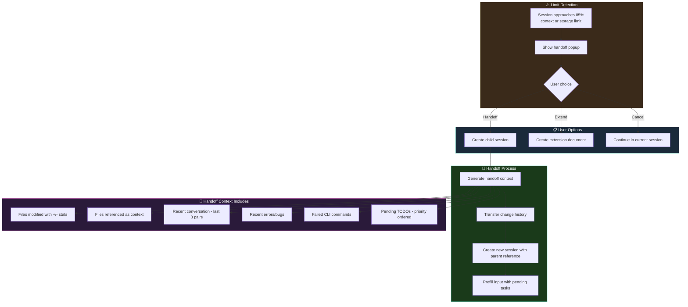
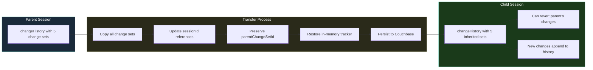
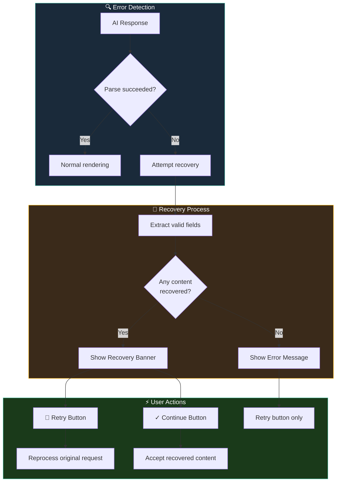
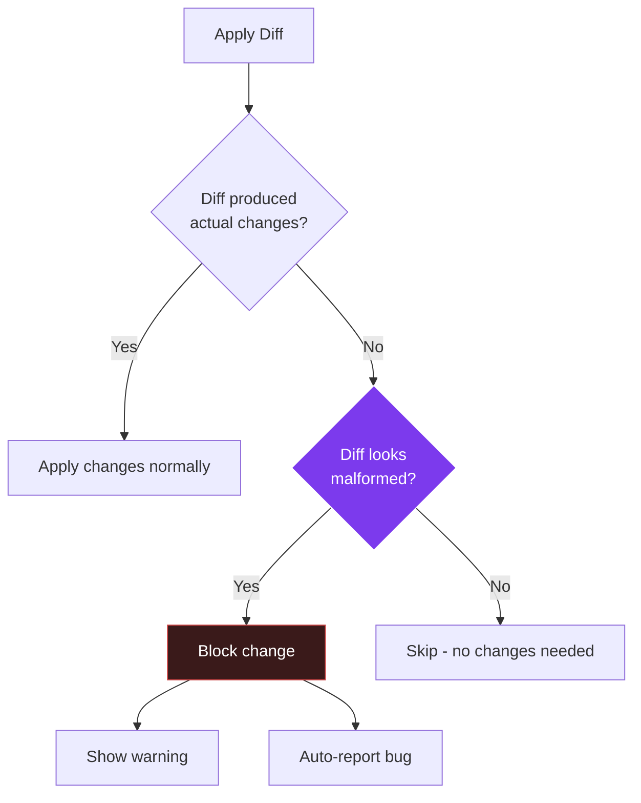
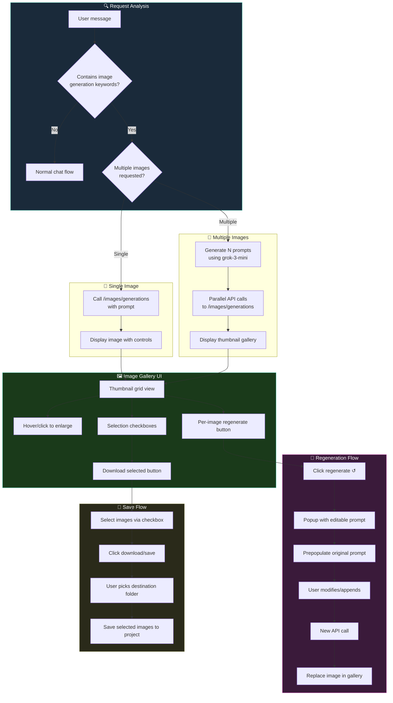

# Chat Flow Design

## Architecture Diagram



[View/Edit on Mermaid Live](https://mermaid.live)

---

## Complete Flow

### 1. **Webview (User Click)**
- `doSend()` gets text from textarea, clears input
- Posts `{type:'sendMessage', text, images}` to extension

### 2. **ChatViewProvider.sendMessage()**
- Creates `ChatRequest` with timestamp
- **Saves to Couchbase** with `status: 'pending'`
- Sends `newMessagePair` → webview renders user bubble + spinner

### 3. **Agent Workflow** (if no images)
- Analyzes request for file/URL references
- Loads matching files into context
- Shows progress: "🔍 Analyzing..." → "📂 Loaded X files"

### 4. **Main API Call**
- Builds messages array (system prompt + history + user message)
- Calls `sendChatCompletion()` with streaming
- Each chunk → `updateResponseChunk` → webview shows partial text

### 5. **SAVE EARLY** (new!)
- Immediately saves raw response text to Couchbase
- Prevents data loss if parsing crashes

### 6. **Parse Response**
- Tries `parseResponse()` (regex-based JSON repair)
- If fails + cleanup enabled → `cleanJsonWithModel()` (AI fixes JSON)
- Extracts: `summary`, `sections`, `todos`, `fileChanges`, `commands`, `nextSteps`
- **If parsing fails with partial recovery** → Shows Recovery Banner with Retry/Continue buttons

### 7. **Save Structured Response**
- Updates Couchbase with full `structured` data
- Records usage (tokens, cost)

### 8. **File Changes** (if any)
- Resolves paths, validates changes
- Calculates diff stats (+added/-removed)
- If `autoApply` → writes files immediately

### 9. **Render Final Output**
- Sends `requestComplete` with `structured` + `diffPreview`
- Webview calls `fmtFinalStructured()` to build HTML:
  - Summary paragraph
  - Sections with headings
  - Code blocks with syntax highlighting
  - File changes with Apply buttons
  - Commands with Run buttons
  - Next Steps buttons (structured format: `{html, inputText}`)
  - "What was done" summary
  - Status bar with action buttons + token count:
    - **✓ Done** (green) - All actions complete
    - **⏳ Pending** (amber) - File changes or CLI commands still need action
- Caches HTML in webview state
- Scrolls to bottom
- **Activates Sticky Summary Bar** if summary/nextSteps scroll out of view

---

## Sticky Summary Bar

When AI responses are long and the user scrolls down, the summary and next-step buttons can scroll out of view. The **Sticky Summary Bar** ensures users always know what happened and can take action.

### How It Works



### UI Layout

```
┌─────────────────────────────────────────────────────────────────┐
│                         Chat Messages                           │
│                              ...                                │
│                    (summary scrolled away)                      │
├─────────────────────────────────────────────────────────────────┤
│  ✓ Added type hints to fibonacci function...  [See details ↑] ✕│
│  ┌──────────────┐  ┌──────────────┐  ┌──────────────┐          │
│  │  Continue... │  │  Run tests   │  │  Apply fix   │          │
│  └──────────────┘  └──────────────┘  └──────────────┘          │
└─────────────────────────────────────────────────────────────────┘
│                        Input Area                               │
└─────────────────────────────────────────────────────────────────┘
```

### Behavior

| Trigger | Result |
|---------|--------|
| Response completes | Summary + nextSteps stored |
| User scrolls summary out of view | Sticky bar appears with slide-up animation |
| User scrolls summary back into view | Sticky bar hides |
| Click next step button | Fills input with `inputText`, hides bar |
| Click "See details ↑" | Smooth scrolls to response, hides bar |
| Click dismiss (✕) | Hides bar permanently for this response |
| New message sent | Clears sticky state |
| Session change | Clears sticky state |

---

## Auto CLI Execution

### Overview

The extension supports automatic execution of CLI commands with a whitelist-based safety system. This enables iterative workflows where the AI can run commands, analyze output, and fix issues automatically.

### Configuration

| Setting | Default | Description |
|---------|---------|-------------|
| `grok.autoApply` | `true` | Master toggle for auto-apply (A=Auto) |
| `grok.autoApplyFiles` | `true` | Auto-apply file changes (CRUD) when Auto mode enabled |
| `grok.autoApplyCli` | `false` | Auto-execute CLI commands when Auto mode enabled |
| `grok.cliWhitelist` | ~40 commands | Allowed command prefixes for auto-execution |

### How It Works



### Whitelist System

Commands are matched by **prefix**. A command like `npm run build` is allowed if `npm run` is in the whitelist.

**Default Whitelist:**
```
npm install, npm run, npm test, yarn install, yarn add, yarn test, yarn build,
pnpm install, pnpm run, git status, git diff, git log, git branch,
ls, pwd, cat, head, tail, grep, find, mkdir, touch, echo,
curl, wget, cp, mv,
tsc, tsc --noEmit, python, python3, pip install, pip3 install,
cargo build, cargo run, cargo test, cargo check, go build, go run, go test
```

**Dangerous commands excluded**: `rm` is intentionally NOT whitelisted. Users will be prompted before any delete operations.

### Run All Commands Button (AI-in-the-Loop)

When a response contains multiple CLI commands, the status bar shows a **"Run X cmds"** button:

```
┌─────────────────────────────────────────────────────────────────┐
│  ⏳ Pending    ✓ 1 applied    [Run 11 cmds]       38,016 tokens │
└─────────────────────────────────────────────────────────────────┘
```

Clicking this button starts **sequential AI-supervised execution**:



**How it works:**
1. First command runs, output displayed with progress summary
2. Summary sent to AI with remaining commands list
3. AI analyzes and responds:
   - Says **"continue"** → next command runs automatically
   - Says **"stop"** or mentions error → execution pauses
   - Suggests different command → AI's command runs instead
4. Loop continues until all done or AI stops it

**Example flow:**
```
Command 1/5 ✓
`mkdir -p app/assets`
Output: (no output)
Progress: ✓ 1 succeeded, ✗ 0 failed
Remaining: curl..., curl..., curl...

→ AI: "Directory created. Continue."
→ [Auto-runs next command]

Command 2/5 ✗
`curl -o file.png https://invalid-url`
Output: curl: (6) Could not resolve host
Progress: ✓ 1 succeeded, ✗ 1 failed

→ AI: "The URL is invalid. Let me fix it..."
→ AI suggests: `curl -o file.png https://correct-url`
→ [Runs AI's corrected command]
```

This enables intelligent error recovery - if `mkdir` fails, AI can check `pwd`, fix the path, and retry.

### Feedback Loop

When a command executes, the output is automatically sent back to the AI:

```
I ran the command: `npm run build`

Output:
```
src/utils.ts(15,10): error TS2322: Type 'string' is not assignable to type 'number'.
```

Please analyze this output.
```

This enables workflows like:
1. User: "Fix the TypeScript errors"
2. AI: Suggests fix + includes `🖥️ tsc --noEmit` command
3. Command auto-executes → output shows remaining errors
4. AI: Analyzes output, suggests next fix
5. Repeat until build passes

### CLI Summary Panel

A sticky panel appears at the bottom during batch command execution:

```
┌─────────────────────────────────────────────────────────────────┐
│  🖥️ CLI Execution           ✓ 3  ✗ 1    4/8           [✕]     │
├─────────────────────────────────────────────────────────────────┤
│  ████████████░░░░░░░░░░░░░░░░░░░░░░░░░░░░░░  (50%)             │
├─────────────────────────────────────────────────────────────────┤
│  ✓ mkdir -p app/assets/css                                     │
│  ✓ curl -o file.png https://...         HTTP 200 OK            │
│  ✓ curl -o logo.svg https://...         HTTP 200 OK            │
│  ✗ curl -o missing.png https://...      404 Not Found          │
├─────────────────────────────────────────────────────────────────┤
│  Next: `python app.py`, `npm run build`                        │
└─────────────────────────────────────────────────────────────────┘
```

**Features:**
- Progress bar fills as commands complete
- Turns red if any command fails
- Shows each command with ✓/✗ status and output preview
- Shows remaining commands queue
- Closeable when done - no scrolling needed

### Security Considerations

- **Whitelist-only by default**: `autoApplyCli` is `false` by default
- **Prefix matching**: Only commands starting with whitelisted prefixes execute
- **User prompt for unknowns**: Non-whitelisted commands require explicit user action
- **Timeout protection**: Commands timeout after 30 seconds
- **Output truncation**: Output capped at 3KB for AI feedback, 5KB for display
- **Dangerous commands excluded**: `rm` is NOT in the default whitelist

---

## File Change Safety & Rollback

### Truncation Protection

The extension **blocks ALL file changes** from truncated responses to prevent file corruption:



**Truncation is detected when:**
- Summary contains "truncated"
- Response text < 200 chars but has file changes
- Response doesn't end with `}` (incomplete JSON)

**When detected:**
```
🚫 BLOCKED: 3 file change(s) from truncated response.
The response was cut off mid-stream. NO changes have been applied.
```

### Rollback System

Every file change is tracked with full content snapshots for reliable rollback:

```
┌─────────────────────────────────────────────────────────────────┐
│  Change History                                    [◀ Rewind]   │
├─────────────────────────────────────────────────────────────────┤
│  ● Change #3 - 2 files (+45 -12) - $0.02 - 3s ago              │
│  ○ Change #2 - 1 file (+10 -3) - $0.01 - 5m ago                │
│  ○ Change #1 - 3 files (+120 -0) - $0.03 - 10m ago             │
└─────────────────────────────────────────────────────────────────┘
```

**Two-tier rollback:**
1. **Primary (fast)**: In-memory snapshots during session
2. **Fallback (persistent)**: Stored `oldContent` in Couchbase

The fallback ensures rollback works even after:
- Extension reload
- VS Code restart
- Session switch

### Change History Data (Couchbase)

```json
{
  "changeHistory": {
    "history": [
      {
        "id": "cs-1703123456789",
        "sessionId": "session-uuid",
        "timestamp": "2025-12-25T08:00:00.000Z",
        "files": [
          {
            "filePath": "/path/to/file.ts",
            "fileName": "file.ts",
            "oldContent": "// original content...",
            "newContent": "// modified content...",
            "stats": { "added": 10, "removed": 3, "modified": 2 },
            "isNewFile": false
          }
        ],
        "totalStats": { "added": 10, "removed": 3, "modified": 2 },
        "applied": true
      }
    ],
    "position": 0
  }
}
```

---

## Session Handoff

When a session approaches context or storage limits, users can **handoff** to a new session. The handoff preserves critical context and enables rollback continuity.

### Handoff Flow



### Change History Transfer

**Critical Feature**: When handing off to a child session, the change history is transferred so rollback works across sessions.



### Handoff Context Format

The handoff message sent to the new session includes:

```markdown
## HANDOFF CONTEXT

**Parent Session:** {sessionId}
**Project:** {projectName}
**Total Exchanges:** {pairCount}
**Tokens Used:** {tokensIn} in / {tokensOut} out

### SESSION SUMMARY
{summary from parent session}

### FILES MODIFIED (X files)
- `src/utils.ts` (+45/-12)
- `src/config.json` (+10/-0)

### FILES REFERENCED (context attached during session)
- `README.md`
- `package.json`

### CURRENT TASKS (continue these - priority order)
1. [ ] Add type hints to fibonacci
2. [ ] Add type hints to reverse_string
3. [ ] Run final tests

### COMPLETED TASKS
- [x] Add type hints to calculate_area
- [x] Add type hints to is_prime

### RECENT CONVERSATION
User: Add type hints to all functions
AI: Added type hints to calculate_area, continuing with is_prime...

### RECENT ERRORS/ISSUES
- JSON: Auto-detected: Response required JSON cleanup

### FAILED CLI COMMANDS
- `python test.py`: pyenv: python: command not found

### INSTRUCTIONS
1. Continue working on CURRENT TASKS in priority order
2. Read the FILES MODIFIED if you need context on what was changed
3. Read the FILES REFERENCED if you need the source content
4. Check RECENT ERRORS if there are issues to address
5. IMPORTANT: When outputting fileChanges, use the EXACT file paths listed above
```

### Session Document Schema (with handoff)

```json
{
  "id": "child-session-uuid",
  "docType": "chat",
  "parentSessionId": "parent-session-uuid",
  "changeHistory": {
    "history": [
      {
        "id": "cs-123",
        "sessionId": "child-session-uuid",
        "parentChangeSetId": "cs-123",
        "files": [...],
        "applied": true
      }
    ],
    "position": 4
  }
}
```

### Handoff vs Extend

| Feature | Handoff | Extend |
|---------|---------|--------|
| **New session created** | ✓ Yes | ✗ No |
| **Context preserved** | Summary only | Full history |
| **Change history** | Transferred | Stays in place |
| **Rollback works** | ✓ Full continuity | ✓ Full continuity |
| **Response speed** | Faster (smaller context) | May slow as history grows |
| **Storage** | New document | Extension documents |
| **When to use** | Long-running tasks, fresh start | Need complete history |

---

## Multi-Step Task Handling

### Problem: Response Truncation

Complex tasks that require 3+ file changes or span multiple concerns (frontend, backend, config, docs) can cause the AI to generate massive responses that get truncated mid-output. This results in:
- Incomplete JSON that fails to parse
- Partial file changes that corrupt files (now blocked!)
- Lost work that must be regenerated

### Solution: Incremental Execution

The system prompt now instructs the AI to execute complex tasks **one step at a time**:

```
┌─────────────────┐     ┌─────────────────┐     ┌─────────────────┐
│  User Request   │────▶│  First Response │────▶│  User: continue │
│  (complex task) │     │  (1-2 steps)    │     │                 │
└─────────────────┘     └─────────────────┘     └────────┬────────┘
                                                         │
         ┌───────────────────────────────────────────────┘
         ▼
┌─────────────────┐     ┌─────────────────┐     ┌─────────────────┐
│  Next Response  │────▶│  User: continue │────▶│  Final Response │
│  (1-2 steps)    │     │                 │     │  (remaining)    │
└─────────────────┘     └─────────────────┘     └─────────────────┘
```

### How It Works

1. **Detection**: AI recognizes tasks with 3+ steps, 3+ files, or multiple concerns
2. **Planning**: Creates TODO list with ALL steps upfront
3. **Execution**: Completes only first 1-2 steps per response
4. **Continuation**: Adds structured nextSteps: `[{"html": "Continue to next step", "inputText": "continue"}]`
5. **Iteration**: On "continue", marks steps complete, executes next batch

### nextSteps Format (Structured)

The `nextSteps` field uses a structured format for better UX:

```json
"nextSteps": [
  {"html": "Continue to next step", "inputText": "continue"},
  {"html": "Run tests to verify", "inputText": "run tests"},
  {"html": "Apply fix to line 45", "inputText": "apply"}
]
```

| Field | Purpose |
|-------|---------|
| `html` | Display text shown on the button (can include emoji) |
| `inputText` | Text inserted into input when clicked |

**Benefits**:
- Clear separation between display and action
- Buttons can show friendly text ("Continue to next step")
- Input receives concise action ("continue")
- Legacy string format still supported but triggers bug report

### Why This Matters: Course Correction

This incremental approach is valuable beyond just preventing truncation:

- **Mistakes are recoverable**: If the AI makes a wrong decision in step 2, the user can correct it before step 3 builds on that mistake
- **User guidance**: The user can redirect the approach ("actually, use library X instead") without starting over
- **Objective alignment**: The ultimate goal of the task is best understood by the user - they can steer the AI toward their vision
- **Learning opportunity**: AI can ask clarifying questions between steps if something is ambiguous
- **Checkpoint saves**: Each step is saved to Couchbase, so work is never lost even if the session is interrupted

### Example Flow

**User**: "Set up deployment for Mac, Windows, and Docker"

**Response 1**:
```json
{
  "summary": "Created config.sample.json for deployment configuration.",
  "todos": [
    {"text": "Create config.sample.json", "completed": true},
    {"text": "Update Mac deployment docs", "completed": false},
    {"text": "Update Windows deployment docs", "completed": false},
    {"text": "Update Docker configuration", "completed": false}
  ],
  "fileChanges": [{"path": "app/config.sample.json", ...}],
  "nextSteps": [{"html": "Continue to Mac deployment", "inputText": "continue"}]
}
```

**User**: clicks "Continue to Mac deployment" button → input receives "continue"

**Response 2**:
```json
{
  "summary": "Updated Mac deployment configuration.",
  "todos": [
    {"text": "Create config.sample.json", "completed": true},
    {"text": "Update Mac deployment docs", "completed": true},
    {"text": "Update Windows deployment docs", "completed": false},
    {"text": "Update Docker configuration", "completed": false}
  ],
  "fileChanges": [{"path": "docs/mac-deploy.md", ...}],
  "nextSteps": [{"html": "Continue to Windows deployment", "inputText": "continue"}]
}
```

### Bug Reporting for Truncation

When truncation is detected (incomplete JSON with recoverable file changes):
1. Warning shown to user: "Response was truncated!"
2. Automatic bug report created with `type: 'Other'`, `by: 'script'`
3. Bug stored in session's `bugs[]` array in Couchbase

---

## Response Recovery Flow

When an AI response has errors (truncation, malformed JSON, or parsing failures), the system attempts recovery and presents users with clear action options.

### Recovery Banner



### UI Layout

When recovery succeeds, users see:

```
┌─────────────────────────────────────────────────────────────────┐
│ ⚠️ AI response had errors - Recovery succeeded!                 │
│                                                                 │
│ Recovered: 8 todo(s), 1 next step(s), 1 command(s).            │
│ The content below may be incomplete.                            │
│                                                                 │
│ ┌──────────────┐  ┌──────────────┐                              │
│ │  🔄 Retry    │  │  ✓ Continue  │                              │
│ └──────────────┘  └──────────────┘                              │
└─────────────────────────────────────────────────────────────────┘
│                                                                 │
│ Added type hints docstring to factorial function...             │
│                                                                 │
│ $ python docs/handoff_test.py                     [▶ Run]       │
│                                                                 │
└─────────────────────────────────────────────────────────────────┘
```

### Action Buttons

| Button | Action | When to Use |
|--------|--------|-------------|
| **🔄 Retry** | Reprocesses the original request | When you need a complete response (file changes were corrupted) |
| **✓ Continue** | Dismisses the warning, accepts recovered content | When the recovered summary/TODOs/commands are sufficient |

### What Gets Recovered

The recovery system attempts to extract:

| Field | Recovery Method |
|-------|-----------------|
| `summary` | Regex extraction from JSON fragments |
| `todos` | Pattern matching for TODO arrays |
| `fileChanges` | Complete file change objects before truncation point |
| `commands` | CLI command arrays |
| `nextSteps` | Next step button arrays |
| `sections` | Content sections with headings |

### Malformed Diff Detection

When file changes have malformed diffs (e.g., from mid-response truncation):



**Malformed diffs are detected when:**
- Lines contain both `-` and `+` concatenated together (e.g., `-old line+new line`)
- Diff application produces no changes but diff content exists
- Lines don't follow proper unified diff format

**Example of corrupted diff (from truncation):**
```diff
# BAD - lines merged together
-def fibonacci(nn+def fibonacci(n: int) -> int:

# GOOD - proper format
-def fibonacci(n):
+def fibonacci(n: int) -> int:
```

### Configuration

| Setting | Default | Description |
|---------|---------|-------------|
| `grok.maxOutputTokens` | `16384` | Maximum output tokens (higher = less truncation) |
| `grok.apiTimeout` | `300` | Request timeout in seconds |

Increasing `maxOutputTokens` reduces truncation frequency for complex responses.

---

## Future: Sub-Task Architecture & Concurrent Operations

### Vision

Break complex tasks into independent sub-operations that can be executed in parallel by separate AI requests, then merged back together. This would dramatically improve:
- **Speed**: Parallel execution instead of sequential
- **Reliability**: Smaller responses = less truncation risk
- **Cost efficiency**: Use cheaper/faster models for simple sub-tasks

### Proposed Architecture

```
┌──────────────────────────────────────────────────────────────────┐
│                        ORCHESTRATOR                              │
│  - Receives user request                                         │
│  - Analyzes task complexity                                      │
│  - Creates sub-task plan                                         │
│  - Dispatches to workers                                         │
│  - Merges results                                                │
└──────────────────────────────────────────────────────────────────┘
         │                    │                    │
         ▼                    ▼                    ▼
┌─────────────────┐  ┌─────────────────┐  ┌─────────────────┐
│   SUB-TASK A    │  │   SUB-TASK B    │  │   SUB-TASK C    │
│  (grok-3-mini)  │  │  (grok-3-mini)  │  │  (grok-3-mini)  │
│                 │  │                 │  │                 │
│  "Create the    │  │  "Update the    │  │  "Write the     │
│   config file"  │  │   Mac docs"     │  │   Dockerfile"   │
└─────────────────┘  └─────────────────┘  └─────────────────┘
         │                    │                    │
         └────────────────────┼────────────────────┘
                              ▼
                    ┌─────────────────┐
                    │     MERGER      │
                    │  - Collects all │
                    │    fileChanges  │
                    │  - Validates    │
                    │  - Presents UI  │
                    └─────────────────┘
```

### Sub-Task Document Schema (Couchbase)

```json
{
  "docType": "subtask",
  "parentSessionId": "session-uuid",
  "subtaskId": "subtask-uuid",
  "status": "pending | running | completed | failed",
  "priority": 1,
  "dependencies": ["subtask-uuid-1"],
  "input": {
    "instruction": "Create config.sample.json with placeholder credentials",
    "contextFiles": ["app/config.json"],
    "constraints": ["Use JSON format", "Include comments"]
  },
  "output": {
    "fileChanges": [...],
    "summary": "...",
    "tokensUsed": 500
  },
  "model": "grok-3-mini",
  "createdAt": "...",
  "completedAt": "..."
}
```

### Orchestration Strategies

#### 1. **Dependency Graph Execution**
- Build DAG of sub-tasks
- Execute independent tasks in parallel
- Wait for dependencies before dependent tasks

```
Example: "Add authentication to the app"

Sub-tasks with dependencies:
1. Create auth config         ──┐
2. Create JWT utilities       ──┼──▶ 4. Create auth middleware ──▶ 5. Update routes
3. Create user model          ──┘
```

#### 2. **Map-Reduce Pattern**
- Split large operations across files
- Each worker handles one file
- Merge all changes at end

```
Example: "Add error handling to all API endpoints"

Map: [route1.ts, route2.ts, route3.ts, route4.ts]
     Each gets own AI call with specific file context
Reduce: Collect all fileChanges, present unified diff
```

#### 3. **Specialist Models**
- Route sub-tasks to appropriate model size
- Simple tasks → grok-3-mini (fast, cheap)
- Complex reasoning → grok-4 (slow, expensive)
- Code review → grok-4 with specific prompts

### Implementation Phases

#### Phase 1: Manual Sub-Tasks (Current)
- AI suggests breaking into steps
- User manually says "continue"
- State tracked in TODO list

#### Phase 2: Semi-Automated (Near Future)
- "Auto-continue" toggle in UI
- System automatically sends "continue" after each step
- User can pause/resume

#### Phase 3: Parallel Execution (Future)
- Orchestrator analyzes request complexity
- Creates sub-task documents in Couchbase
- Spawns parallel API calls
- Merges results with conflict detection
- Presents unified output

### Concurrency Considerations

| Concern | Solution |
|---------|----------|
| **File conflicts** | Lock files during sub-task execution; detect overlapping edits |
| **Context limits** | Each sub-task gets minimal context (only files it needs) |
| **Error handling** | Failed sub-task → retry or escalate to user |
| **Cost tracking** | Aggregate token usage across all sub-tasks |
| **Rate limits** | Queue system with configurable parallelism |

### API Design Sketch

```typescript
interface SubTaskPlan {
  tasks: SubTask[];
  executionOrder: 'sequential' | 'parallel' | 'dependency-graph';
  estimatedCost: number;
  estimatedTimeMs: number;
}

interface SubTask {
  id: string;
  instruction: string;
  contextFiles: string[];
  model: 'grok-3-mini' | 'grok-4';
  dependsOn: string[];
  priority: number;
}

// Orchestrator methods
async function planSubTasks(request: string): Promise<SubTaskPlan>;
async function executeSubTasks(plan: SubTaskPlan): Promise<MergedResult>;
async function mergeResults(results: SubTaskResult[]): Promise<FileChange[]>;
```

### Benefits of This Architecture

1. **Eliminates truncation**: Each sub-task produces small, focused output
2. **Faster completion**: Parallel execution of independent tasks
3. **Lower costs**: Use cheaper models for simple sub-tasks
4. **Better reliability**: Retry individual failures without losing progress
5. **Transparent progress**: Show real-time status of each sub-task
6. **Resumable**: Sub-task state persisted in Couchbase

### Design Decisions

#### Q: How to handle sub-tasks that need to reference each other's output?

**Solution**: Use Couchbase to store shared/intermediate data. Each sub-task can read from and write to a shared context document:

```json
{
  "docType": "subtask-context",
  "parentSessionId": "session-uuid",
  "sharedData": {
    "authConfig": { "jwtSecret": "..." },
    "createdFiles": ["src/auth/config.ts", "src/auth/jwt.ts"]
  },
  "stepOutputs": {
    "subtask-1": { "exportedTypes": ["User", "AuthToken"] },
    "subtask-2": { "middlewareName": "authMiddleware" }
  }
}
```

Dependent sub-tasks wait for their dependencies to complete and read from `stepOutputs`.

---

#### Q: Should users be able to edit/reorder the sub-task plan before execution?

**Solution**: Present execution strategy options to the user upfront with recommendations:

```
┌─────────────────────────────────────────────────────────────────┐
│  📋 Execution Plan: "Add authentication to the app"            │
├─────────────────────────────────────────────────────────────────┤
│  Found 5 sub-tasks. Choose execution strategy:                 │
│                                                                 │
│  ○ A) Parallel (Recommended)                                   │
│      Speed: ⚡⚡⚡  Cost: $0.04  Risk: Medium                   │
│      4 tasks run simultaneously, 1 waits for dependencies      │
│                                                                 │
│  ○ B) Sequential                                                │
│      Speed: ⚡     Cost: $0.03  Risk: Low                       │
│      Safest option, but takes longer                           │
│                                                                 │
│  ○ C) Fast & Loose                                              │
│      Speed: ⚡⚡⚡⚡ Cost: $0.05  Risk: High                     │
│      All parallel, may need conflict resolution                │
│                                                                 │
│  [Edit Plan]  [Start A]  [Start B]  [Start C]                  │
└─────────────────────────────────────────────────────────────────┘
```

User can also click "Edit Plan" to reorder, remove, or modify sub-tasks before execution.

---

#### Q: How to present parallel progress in the UI?

**Solution**: Stacked progress bars, one per sub-task:

```
┌─────────────────────────────────────────────────────────────────┐
│  🔄 Running 3 sub-tasks in parallel...                         │
├─────────────────────────────────────────────────────────────────┤
│  1. Create auth config      ████████████████████░░░░  80%      │
│  2. Create JWT utilities    ██████████████████████░░  90%  ✓   │
│  3. Create user model       ████████░░░░░░░░░░░░░░░░  35%      │
├─────────────────────────────────────────────────────────────────┤
│  ⏳ Waiting: 4. Create auth middleware (depends on 1, 2, 3)    │
│  ⏳ Waiting: 5. Update routes (depends on 4)                   │
└─────────────────────────────────────────────────────────────────┘
```

Each bar shows:
- Sub-task name
- Visual progress
- Percentage
- Checkmark when complete
- "Waiting" status for dependent tasks

---

#### Q: What's the optimal sub-task granularity?

**Solution**: Let the AI suggest options and ask user to choose:

```
┌─────────────────────────────────────────────────────────────────┐
│  📊 Task Breakdown Options                                      │
├─────────────────────────────────────────────────────────────────┤
│  Your request can be broken down in different ways:            │
│                                                                 │
│  A) Fine-grained (Recommended)                                  │
│     12 sub-tasks, ~200 tokens each                             │
│     ✓ Lowest truncation risk                                   │
│     ✓ Best parallelism                                         │
│     ✗ More API overhead                                        │
│                                                                 │
│  B) Medium                                                      │
│     5 sub-tasks, ~800 tokens each                              │
│     ✓ Good balance                                             │
│     ~ Moderate risk                                            │
│                                                                 │
│  C) Coarse                                                      │
│     2 sub-tasks, ~2000 tokens each                             │
│     ✓ Fewer API calls                                          │
│     ✗ Higher truncation risk                                   │
│                                                                 │
│  [Use A]  [Use B]  [Use C]  [Let AI decide]                    │
└─────────────────────────────────────────────────────────────────┘
```

Default to "Let AI decide" which uses heuristics based on:
- Task complexity
- Number of files involved
- Historical truncation rates for similar tasks

---

## Image Generation Workflow

### Overview

The extension supports AI-powered image generation using the `grok-2-image` model. Unlike chat/vision models that take images as input, the image generation model:
- Takes **text only** as input
- Produces **images** as output
- Uses a separate endpoint: `/v1/images/generations`

### Model Configuration

| Setting | Model | Purpose |
|---------|-------|---------|
| `grok.modelVision` | grok-4 | **Understanding** images (input: image → output: text) |
| `grok.modelImageCreate` | grok-2-image | **Creating** images (input: text → output: image) |

### Image Generation Flow



### API Details

#### Endpoint
```
POST https://api.x.ai/v1/images/generations
```

#### Request Body
```json
{
  "model": "grok-2-image",
  "prompt": "A cat sitting on a rainbow bridge in space",
  "n": 4,
  "response_format": "url"
}
```

#### Response
```json
{
  "data": [
    {
      "url": "https://..../image1.jpg",
      "revised_prompt": "A detailed 3D render of a fluffy orange cat..."
    },
    {
      "url": "https://..../image2.jpg",
      "revised_prompt": "..."
    }
  ]
}
```

### Detection Keywords

The system detects image generation requests by looking for phrases like:
- "create an image", "generate an image", "make an image"
- "draw", "create a picture", "generate a picture"
- "create icon(s)", "generate icon(s)", "create logo"
- "create illustration", "generate artwork"
- "design an image", "produce an image"

Count detection via patterns like "4 icons", "3 images", "5 logo ideas".

### Multi-Image Generation Example

**User**: "Create 4 icon ideas for my mobile app logo based on the README of the project"

**Flow**:
1. Detect image generation request with count=4
2. Load README content as context
3. Use `grok-3-mini` to generate 4 distinct prompts:
   ```json
   [
     "A minimalist mobile app icon featuring a stylized chat bubble with a gear inside...",
     "A modern gradient app icon showing interconnected nodes representing AI...",
     "A bold circular icon with a lightning bolt and code brackets...",
     "A friendly mascot-style icon featuring a robot assistant..."
   ]
   ```
4. Make 4 parallel calls to `/images/generations`
5. Display 4 thumbnails in a grid

### Image Gallery UI

```
┌─────────────────────────────────────────────────────────────────┐
│  🎨 Generated Images (4)                    [💾 Save Selected]  │
├─────────────────────────────────────────────────────────────────┤
│  ┌──────────┐  ┌──────────┐  ┌──────────┐  ┌──────────┐        │
│  │ [☐]      │  │ [☑]      │  │ [☐]      │  │ [☑]      │        │
│  │          │  │          │  │          │  │          │        │
│  │  img 1   │  │  img 2   │  │  img 3   │  │  img 4   │        │
│  │          │  │          │  │          │  │          │        │
│  │   [↺]    │  │   [↺]    │  │   [↺]    │  │   [↺]    │        │
│  └──────────┘  └──────────┘  └──────────┘  └──────────┘        │
│                                                                 │
│  Hover to enlarge • Click to view full size                    │
└─────────────────────────────────────────────────────────────────┘
```

**Controls**:
- `[☐/☑]` - Checkbox to select for download
- `[↺]` - Regenerate button (opens prompt editor)
- `[💾 Save Selected]` - Download selected images

### Regeneration Popup

When clicking the regenerate button [↺]:

```
┌─────────────────────────────────────────────────────────────────┐
│  🔄 Regenerate Image                                      [✕]  │
├─────────────────────────────────────────────────────────────────┤
│  Original Prompt:                                               │
│  ┌─────────────────────────────────────────────────────────┐   │
│  │ A minimalist mobile app icon featuring a stylized chat  │   │
│  │ bubble with a gear inside, using blue and white colors, │   │
│  │ clean lines, modern design aesthetic                    │   │
│  └─────────────────────────────────────────────────────────┘   │
│                                                                 │
│  💡 Edit the prompt above or add to it below:                  │
│  ┌─────────────────────────────────────────────────────────┐   │
│  │ make it darker, add a gradient, more 3D look            │   │
│  └─────────────────────────────────────────────────────────┘   │
│                                                                 │
│                          [Cancel]  [🎨 Regenerate]              │
└─────────────────────────────────────────────────────────────────┘
```

**Behavior**:
1. Shows original prompt (prepopulated, editable)
2. Optional "add refinement" field that appends to prompt
3. On regenerate: combines prompt + refinements, makes new API call
4. New image replaces original in gallery position

### Save/Download Flow

1. User selects images via checkboxes
2. Clicks "Save Selected" button
3. VS Code file picker opens
4. User selects destination folder
5. Images saved as `image-001.jpg`, `image-002.jpg`, etc.
6. Confirmation message shown

### Data Schema (Couchbase)

Generated images are stored in the chat pair's response:

```json
{
  "docType": "chat-pair",
  "structured": {
    "generatedImages": [
      {
        "id": "img-1703123456789-abc123",
        "originalPrompt": "Create a minimalist app icon...",
        "revisedPrompt": "A 3D rendered minimalist...",
        "url": "https://..../image.jpg",
        "timestamp": 1703123456789,
        "selected": false
      }
    ]
  }
}
```

### Cost Tracking

Image generation uses a flat per-image pricing model:
- ~$0.07 per image (as of 2024)
- Displayed in the token/cost bar after generation