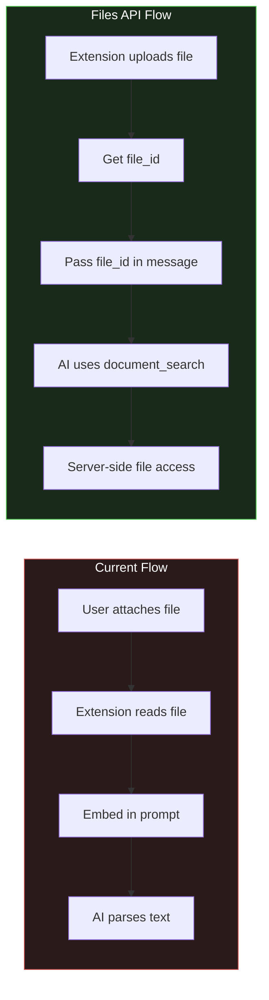
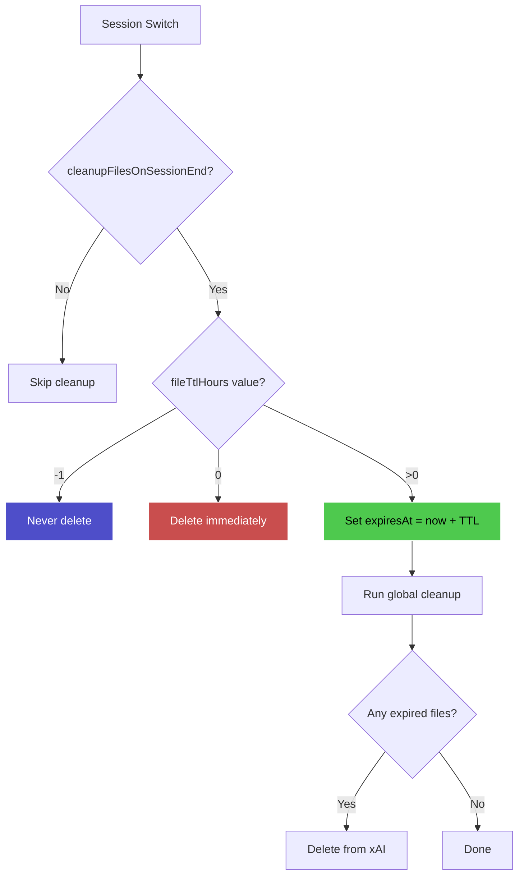

# xAI Files API Integration Proposal

> ⚠️ **IMPORTANT: REST API Limitation (Dec 2025)**
> 
> The Files API with `document_search` is **NOT currently supported** via the REST `/v1/chat/completions` endpoint. All official xAI examples use the **Python SDK (gRPC)**. Attempting to use file attachments over REST causes "terminated" errors.
> 
> **Recommendation:** Keep `grok.useFilesApi` set to `false` (the default) until xAI provides REST support or this extension integrates the gRPC SDK.

---

## The Problem: Manual File Management

Currently, the extension requires **manual file attachment** for the AI to see file contents:

1. User types backtick (`) to search workspace files
2. User selects files to attach
3. Extension reads files and embeds content in the prompt
4. AI processes the embedded text

**Pain points:**
- User must remember to attach files before asking questions
- Large files consume tokens (risk of truncation)
- AI can hallucinate if it claims to "read" files not attached
- MD5 hash verification was added to prevent hallucination, but adds complexity

With **Grok 4.1's improved capabilities**, the AI is so good that it reduces workload significantly - but the file management friction remains a bottleneck.

---

## The Solution: xAI Files API

The [xAI Files API](https://docs.x.ai/docs/guides/files) enables uploading files to xAI's servers, where the AI can use a **server-side `document_search` tool** to intelligently search and reason over file contents.

### How It Works



### Key Benefits

| Aspect | Current Approach | Files API Approach |
|--------|-----------------|-------------------|
| **Hallucination** | MD5 hash verification needed | Server-side search - AI reads *actual* content |
| **Token Usage** | Full file in prompt | Efficient server-side processing |
| **Large Files** | Truncation risk | 48MB limit, handled efficiently |
| **Multi-turn** | Re-attach each turn | Files persist across conversation |
| **Search** | AI sees all or nothing | AI can search multiple times with different queries |

---

## Proposed Implementation

### Phase 1: File Upload Service

Create `src/api/fileUploader.ts`:

```typescript
import * as vscode from 'vscode';
import { debug, info, error as logError } from '../utils/logger';

export interface UploadedFile {
    id: string;           // file_id from xAI
    filename: string;
    size: number;
    createdAt: string;
    localPath: string;    // Original workspace path
}

/**
 * Upload a file to xAI Files API
 */
export async function uploadFile(
    filePath: string,
    apiKey: string
): Promise<UploadedFile> {
    const config = vscode.workspace.getConfiguration('grok');
    const baseUrl = config.get<string>('apiBaseUrl') || 'https://api.x.ai/v1';
    
    // Read file content
    const uri = vscode.Uri.file(filePath);
    const content = await vscode.workspace.fs.readFile(uri);
    const filename = filePath.split('/').pop() || 'file';
    
    // Create form data
    const formData = new FormData();
    formData.append('file', new Blob([content]), filename);
    
    const response = await fetch(`${baseUrl}/v1/files`, {
        method: 'POST',
        headers: {
            'Authorization': `Bearer ${apiKey}`
        },
        body: formData
    });
    
    if (!response.ok) {
        const errorText = await response.text();
        throw new Error(`File upload failed: ${response.status} - ${errorText}`);
    }
    
    const data = await response.json();
    
    info(`Uploaded file: ${filename} -> ${data.id}`);
    
    return {
        id: data.id,
        filename: data.filename,
        size: data.size,
        createdAt: data.created_at,
        localPath: filePath
    };
}

/**
 * Delete a file from xAI
 */
export async function deleteFile(fileId: string, apiKey: string): Promise<void> {
    const config = vscode.workspace.getConfiguration('grok');
    const baseUrl = config.get<string>('apiBaseUrl') || 'https://api.x.ai/v1';
    
    await fetch(`${baseUrl}/v1/files/${fileId}`, {
        method: 'DELETE',
        headers: {
            'Authorization': `Bearer ${apiKey}`
        }
    });
    
    debug(`Deleted file: ${fileId}`);
}

/**
 * List uploaded files
 */
export async function listFiles(apiKey: string): Promise<UploadedFile[]> {
    const config = vscode.workspace.getConfiguration('grok');
    const baseUrl = config.get<string>('apiBaseUrl') || 'https://api.x.ai/v1';
    
    const response = await fetch(`${baseUrl}/v1/files`, {
        headers: {
            'Authorization': `Bearer ${apiKey}`
        }
    });
    
    if (!response.ok) {
        throw new Error(`Failed to list files: ${response.status}`);
    }
    
    const data = await response.json();
    return data.data || [];
}
```

### Phase 2: Modify Agent Orchestrator

Update `agentOrchestrator.ts` to upload files instead of embedding content:

```typescript
// In executeActions(), instead of reading file content:

// OLD: Read and embed
const content = await readFile(filePath);
filesContent.set(filePath, content);

// NEW: Upload and get file_id
const uploaded = await uploadFile(filePath, apiKey);
uploadedFiles.set(filePath, uploaded.id);
```

### Phase 3: Modify Chat Completions

Update `grokClient.ts` to support file attachments:

```typescript
export interface GrokMessageContent {
    type: 'text' | 'image_url' | 'file';  // Add 'file' type
    text?: string;
    image_url?: { url: string };
    file_id?: string;  // NEW: For Files API
}

// In message construction:
const content: GrokMessageContent[] = [];

// Add file references
for (const fileId of uploadedFileIds) {
    content.push({ type: 'file', file_id: fileId });
}

// Add user text
content.push({ type: 'text', text: userMessage });
```

### Phase 4: File Lifecycle Management

Track uploaded files per session to clean up when session ends:

```typescript
// In ChatSessionDocument
interface ChatSessionDocument {
    // ... existing fields
    uploadedFiles?: {
        fileId: string;
        localPath: string;
        uploadedAt: string;
    }[];
}

// On session end or cleanup
async function cleanupSessionFiles(sessionId: string, apiKey: string) {
    const session = await getSession(sessionId);
    for (const file of session.uploadedFiles || []) {
        await deleteFile(file.fileId, apiKey);
    }
}
```

---

## Automatic File Upload Workflow

### Option A: Upload on First Reference

When the agent workflow identifies files to load (Pass 1 planning), automatically upload them:

```mermaid
flowchart TD
    A[User: "Review auth.py"] --> B[Pass 1: Plan]
    B --> C[Action: file pattern **/*auth*.py]
    C --> D[Pass 2: Find matching files]
    D --> E{Files found?}
    E -->|Yes| F[Upload to xAI Files API]
    F --> G[Get file_ids]
    G --> H[Pass 3: Chat with file_ids attached]
    E -->|No| I[Report: No files found]
    
    style F fill:#4ec94e,stroke:#fff,color:#000
```

### Option B: Workspace Sync (Advanced)

Pre-upload key workspace files when session starts:

```typescript
// On session start
const keyFiles = ['package.json', 'tsconfig.json', 'README.md'];
for (const file of keyFiles) {
    const uploaded = await uploadFile(file, apiKey);
    sessionFiles.push(uploaded);
}
```

---

## Configuration

Add new settings to `package.json`:

```json
{
    "grok.useFilesApi": {
        "type": "boolean",
        "default": false,
        "description": "Use xAI Files API for file handling (experimental)"
    },
    "grok.autoUploadFiles": {
        "type": "boolean", 
        "default": true,
        "description": "Automatically upload files identified by agent workflow"
    },
    "grok.maxUploadSize": {
        "type": "number",
        "default": 10485760,
        "description": "Maximum file size to upload (bytes, default 10MB)"
    },
    "grok.cleanupFilesOnSessionEnd": {
        "type": "boolean",
        "default": true,
        "description": "Delete uploaded files when session ends"
    }
}
```

---

## Pricing Considerations

| Component | Cost |
|-----------|------|
| File upload | Free |
| File storage | Free (but cleanup recommended) |
| `document_search` tool | **$10 per 1,000 invocations** |
| Token usage | Standard model rates |

**Estimate**: If AI searches documents 2-3 times per response, a 100-message session would cost ~$2-3 in document_search fees, plus normal token costs.

---

## Model Requirements

The Files API requires **agentic-capable models**:

- ✅ `grok-4` 
- ✅ `grok-4-fast`
- ❌ `grok-3-mini` (planning model - doesn't support files)
- ❌ Non-agentic models

This means the **planning pass (Pass 1)** would still use the current approach, but the **main reasoning pass** would benefit from Files API.

---

## Migration Path

### Step 1: Feature Flag
Add `grok.useFilesApi` setting (default: false)

### Step 2: Parallel Implementation
Keep current MD5 hash approach working alongside Files API

### Step 3: Gradual Rollout
- Test with small files first
- Monitor document_search costs
- Gather feedback on accuracy vs current approach

### Step 4: Default Switch
If Files API proves more reliable, make it the default

---

## Comparison: Current vs Files API

| Scenario | Current (MD5 Hash) | Files API |
|----------|-------------------|-----------|
| User asks about a file | Must attach or agent loads it | Auto-upload, AI searches |
| AI modifies file | Needs hash to verify it saw content | Inherently verified - used server-side search |
| Large codebase | Token limits, truncation risk | 48MB per file, efficient search |
| Follow-up questions | Re-attach or rely on history | Files persist across turns |
| Cost | Tokens only | Tokens + $0.01 per search |

---

## Open Questions

1. **Caching**: Should we cache uploaded file_ids to avoid re-uploading unchanged files?
2. **Diff handling**: After AI proposes changes, should we upload the *modified* file for verification?
3. **Binary files**: Current approach only handles text - Files API supports PDFs too
4. **Rate limits**: What are the upload/search rate limits?

---

## Implementation Status ✅

All core components have been implemented:

1. ✅ Created `src/api/fileUploader.ts` with upload/delete/list functions
2. ✅ Added `grok.useFilesApi` configuration option (+ 3 related settings)
3. ✅ Modified `agentOrchestrator.ts` with `runFilesApiWorkflow()` function
4. ✅ Updated `grokClient.ts` with `createFileMessage()` and file content type
5. ✅ Added file lifecycle tracking to `chatSessionRepository.ts` (`UploadedFileRecord`)
6. ✅ Updated `ChatViewProvider.ts` to use Files API when enabled
7. ✅ Added cleanup on session switch/creation

### Files Modified

| File | Changes |
|------|---------|
| `src/api/fileUploader.ts` | **NEW** - Upload/delete/list functions for xAI Files API |
| `src/api/grokClient.ts` | Added `file` type to `GrokMessageContent`, `createFileMessage()` function |
| `src/storage/chatSessionRepository.ts` | Added `UploadedFileRecord` interface, tracking functions |
| `src/agent/agentOrchestrator.ts` | Added `runFilesApiWorkflow()`, `buildFilesApiMessage()` |
| `src/views/ChatViewProvider.ts` | Files API workflow branch, cleanup on session change |
| `package.json` | Added 4 new configuration options |

### New Configuration Options

| Setting | Default | Description |
|---------|---------|-------------|
| `grok.useFilesApi` | `false` | Enable Files API (uploads to xAI) |
| `grok.autoUploadFiles` | `true` | Auto-upload files from agent workflow |
| `grok.maxUploadSize` | 10MB | Maximum file size to upload |
| `grok.cleanupFilesOnSessionEnd` | `true` | Enable cleanup logic when session ends |
| `grok.fileTtlHours` | 24 | Hours to keep files before cleanup (0=immediate, -1=never) |

---

## File Lifecycle & TTL

Files uploaded to xAI persist indefinitely until explicitly deleted. The extension provides TTL (Time-To-Live) based cleanup:

### TTL Behavior

| `fileTtlHours` | Behavior |
|----------------|----------|
| `0` | Delete immediately on session switch (legacy) |
| `24` (default) | Mark with 24h expiration, cleanup on next session load |
| `-1` | Never auto-delete (manual cleanup only) |

### How TTL Works



### Rehydration

If you return to a session and files were deleted (TTL expired), the extension can **rehydrate** them:

```typescript
import { rehydrateFile } from '../api/fileUploader';

// Check if file needs re-upload and do it automatically
const result = await rehydrateFile(
    '/path/to/file.ts',
    existingRecord?.fileId,  // Previous file_id (may be expired)
    apiKey
);

if (result.success) {
    // result.file.id is valid - either existing or newly uploaded
}
```

### API Functions

| Function | Location | Purpose |
|----------|----------|---------|
| `setFileTtl()` | chatSessionRepository.ts | Set expiration time for files |
| `getExpiredFiles()` | chatSessionRepository.ts | Get expired files for a session |
| `getExpiredFilesGlobal()` | chatSessionRepository.ts | Query all sessions for expired files |
| `removeExpiredFileRecords()` | chatSessionRepository.ts | Remove records after xAI deletion |
| `needsRehydration()` | chatSessionRepository.ts | Check if file needs re-upload |
| `rehydrateFile()` | fileUploader.ts | Re-upload if file missing on xAI |
| `fileExists()` | fileUploader.ts | Check if file_id still valid |

---

## Next Steps

1. [ ] Test with various file types and sizes
2. [ ] Monitor costs ($10 per 1K document_search invocations)
3. [ ] Evaluate accuracy vs current MD5 hash approach
4. [ ] Consider making Files API the default if proven reliable

---

## References

- [xAI Files API Guide](https://docs.x.ai/docs/guides/files)
- [Managing Files](https://docs.x.ai/docs/guides/files/managing-files)
- [Chat with Files](https://docs.x.ai/docs/guides/files/chat-with-files)
- [Files API Reference](https://docs.x.ai/docs/files-api)
